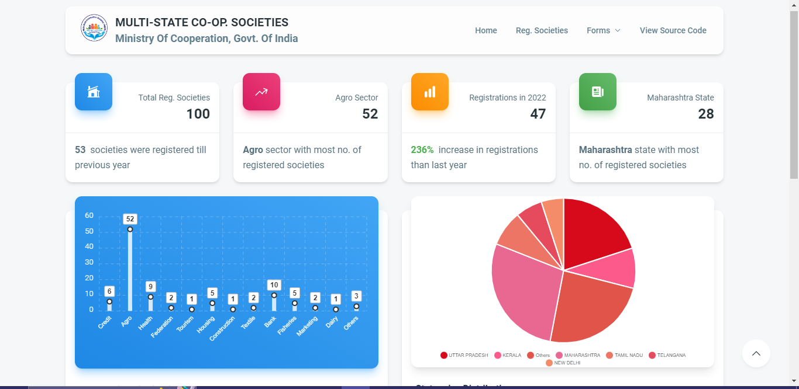
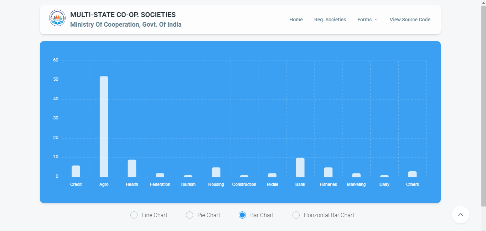
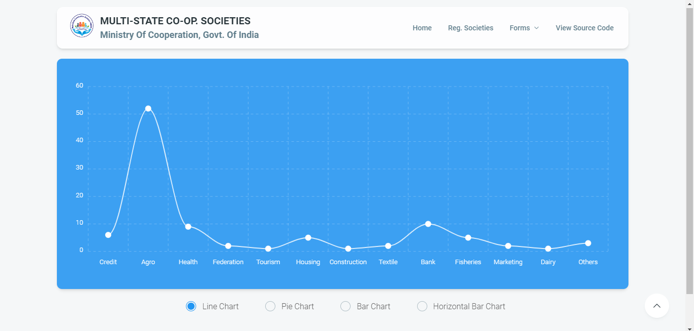
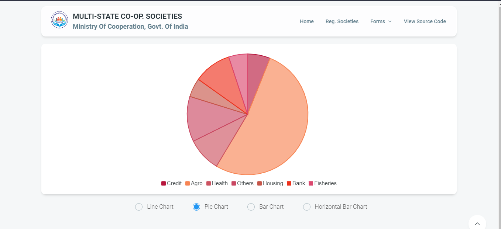
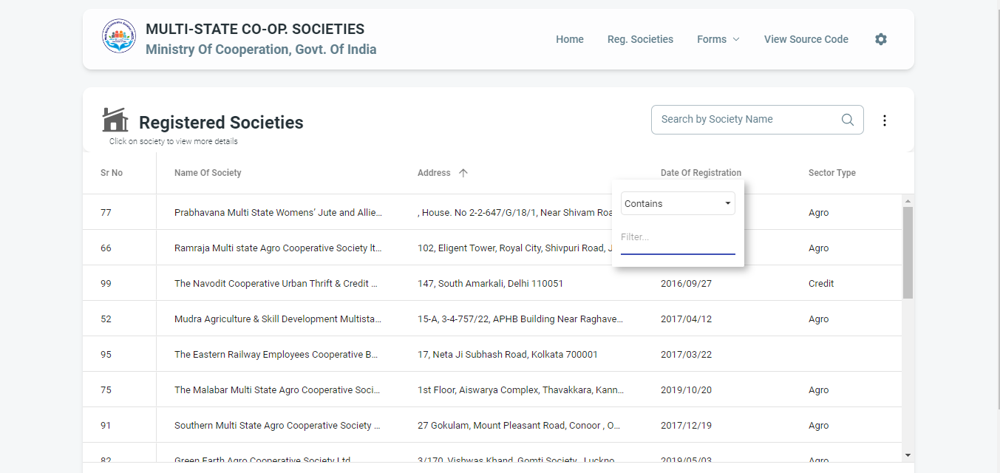
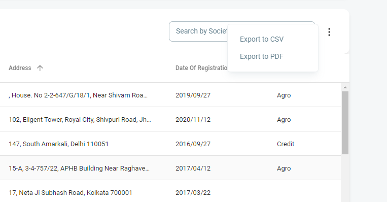
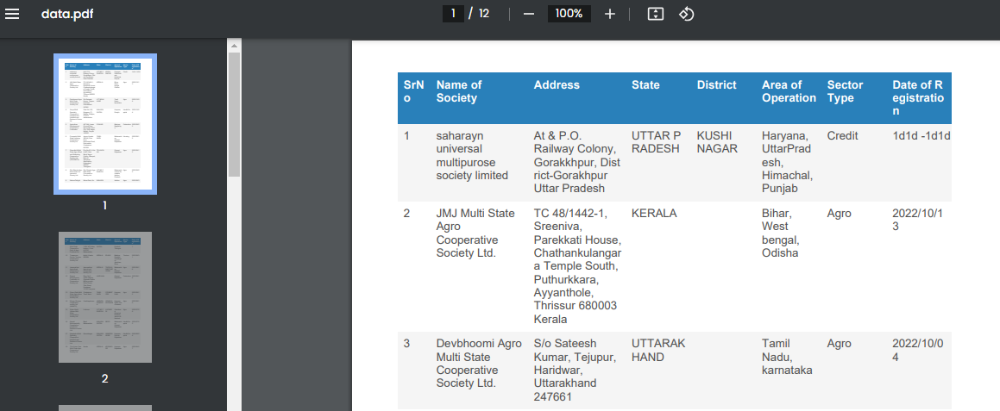
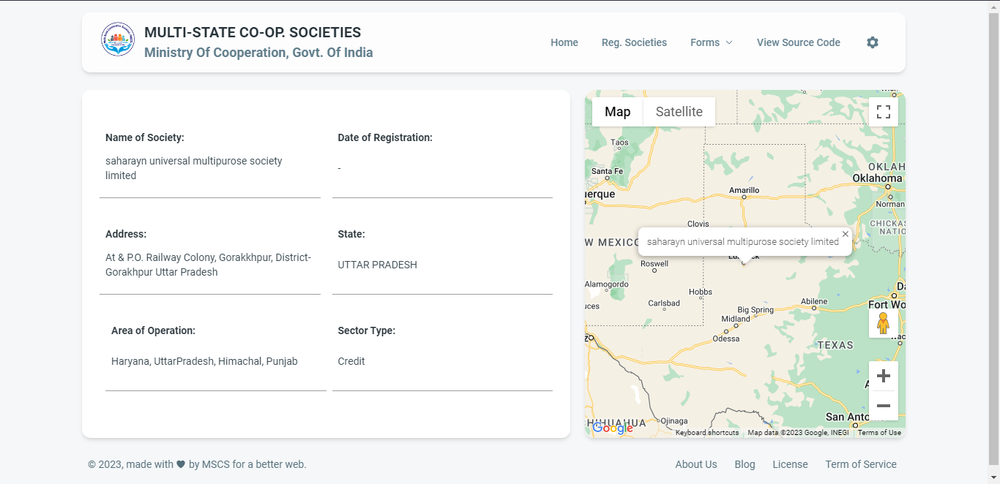

# Dashboard - Central Registrar for Co-operative Societies Portal

The dashboard was made as per the dataset provided and requirements stated in the hackathon (2023) organized by CRCS.

## Features / Modules 💡

- 
 <b><u>Trends & insights</u>: </b>View key trends and insights from the dataset on dashboard itself.

- 
 <b><u>Charts for categories</u>: </b>Plot the data on chart as per (Sector-wise, State-wise, Year-wise & Month-wise) distribution.

- 
 <b><u>Switch between types of charts</u>📊: </b>On expanding the chart, allow user to switch between chart types such as Line,bar, Pie and Column Chart in individual category.

- 
<b><u>Sorting, Filtering, Searching</u>🔍: </b>View Entire data in table. Allow user to sort, apply filters on individual columns and allow user to search in entire dataset.

- 
<b><u>Export to PDF & CSV</u>: </b>Allow user to export data in either CSV or PDF format.

- 
<b><u>Visualize society on Map</u>🗺️: </b>View entire details of a society and view it on map.

## Screenshots ✨

<table>
    <tr>
        <td></td>
        <td></td>
    </tr>
    <tr>
        <td></td>
        <td></td>
    </tr>
    <tr>
        <td></td>
        <td></td>
    </tr>
    <tr>
        <td></td>
        <td></td>
    </tr>
</table>

## Tech Stack 👨‍💻

- React.js
- MaterialUI
- ApexCharts.js
- AG DataGrid
- Google Maps API
- GeoApify (Geocoding)

To run project: npm i --> npm run dev
